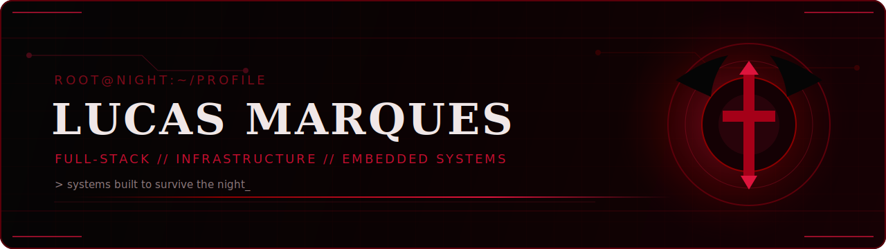

<div align="center">
  
</div>

```text
--[ 0x01. PROFILE ]------------------------------------------------------------
> Full-Stack Developer from Curitiba, Brazil.
> Building modern web platforms, scalable APIs and infrastructure.
> Also exploring embedded automotive systems and real-time telemetry.
> Clean architecture. DDD. Containers. Systems made to survive the night.
```

```text
--[ 0x02. CORE STACK ]---------------------------------------------------------
* Runtime:       Bun, Node.js
* Languages:     TypeScript, JavaScript, C
* Frontend:      Next.js, React, Tailwind CSS, shadcn/ui
* Backend:       Elysia, REST APIs, JWT, Domain-Driven Design
* Data:          PostgreSQL, Redis, Drizzle ORM
* Infrastructure:Docker, Nginx, Cloudflare, Linux, GitHub Actions
* Embedded:      ECU telemetry, OBD-II, CAN, MISRA-C
```

```text
--[ 0x03. CURRENT FOCUS ]-------------------------------------------------------
* SaaS platforms and internal business systems
* AI-assisted products and automation
* Reliable deployments, monitoring and infrastructure
* Automotive telemetry and embedded experimentation
```

```text
--[ 0x04. SELECTED PROJECTS ]--------------------------------------------------
```

| Project | Description | Stack |
|:--|:--|:--|
| [foodVision](https://github.com/lucasmarques594/foodVision) | Multimodal AI that transforms ingredient images into complete recipes. | TypeScript |
| [autocatalog](https://github.com/lucasmarques594/autocatalog) | Full-stack vehicle marketplace with detailed search and store profiles. | TypeScript |
| [ecu_modular](https://github.com/lucasmarques594/ecu_modular) | Modular ECU monitoring and real-time automotive signal processing. | C |
| [obd2](https://github.com/lucasmarques594/obd2) | OBD-II reader compatible with ELM327 interfaces. | C |

```text
--[ 0x05. CONTACT ]------------------------------------------------------------
```

<p align="left">
  <a href="https://www.linkedin.com/in/lucasmarques594">LinkedIn</a>
  &nbsp;·&nbsp;
  <a href="https://www.instagram.com/shinemotx">Instagram</a>
  &nbsp;·&nbsp;
  <a href="https://github.com/lucasmarques594">GitHub</a>
</p>

<details>
  <summary><code>open activity.log</code></summary>
  <br />
  <p align="center">
    
    
  </p>
</details>

---

```text
blood fades // code remains // EOF
```
